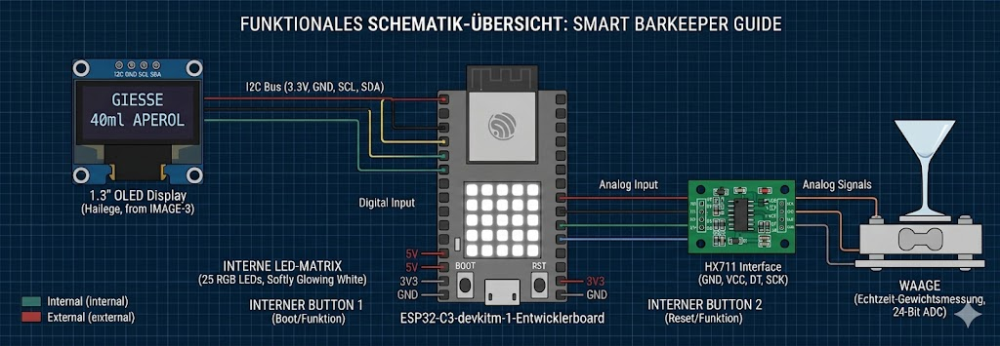

# Projekt-Idee: Barkeeper Guide

## 1. Projektübersicht
**Titel:** Barkeeper Guide – Präzisions-Mischassistent für Kaltgetränke
**Hardware:** ESP32-C3 (RISC-V), integrierte 25-LED-Matrix, HX711 Wägezellen-Modul, OLED-Display
**Framework:** ESP-IDF (Espressif IoT Development Framework)

## 2. Zielsetzung 
Das Ziel des Projekts ist ein digitaler Mischassistent, der beim exakten Zubereiten von Getränken hilft. Über eine integrierte Waage erkennt das System in Echtzeit die Füllmenge und führt den Nutzer Schritt für Schritt durch das Rezept. So wird sichergestellt, dass das Mischverhältnis immer perfekt stimmt, ohne dass man selbst abmessen muss.

## 3. Technische Features & Umsetzung
### Hardware-Komponenten
* **ESP32-C3:** Zentrale Steuerung.
* **25-LED-Matrix:** Visuelles Feedback des Füllstandes (Farbcodierung nach Zutat, z. B. Orange für Aperol).
* **Wägezelle (5kg):** Echtzeit-Gewichtsmessung mit Tara-Funktion.
* **OLED-Display (I2C):** Schritt-für-Schritt-Anweisungen für den Anwender.

### Software-Stack (ESP-IDF)
* **Sensorik:** Implementierung des HX711-Protokolls zur Datenerfassung.
* **UI/UX:** Dynamische Ansteuerung der LED-Matrix zur Visualisierung des Fortschritts.

### Benutzerführung
Die Bedienung erfolgt über zwei Taster, die am Board direkt integriert sind.
* **Navigations-Taste:** Durchblättern der hinterlegten Rezepte im Menü.
* **Bestätigungs/Tara-Taste:** Auswahl des Getränks und manuelles/automatisches Nullstellen der Waage zwischen den Zutaten.

### Optionale Erweiterung (Konnektivität):
Obwohl der Fokus auf der lokalen Hardware-Steuerung liegt, ist das System modular für eine WLAN-Anbindung vorbereitet.

* **Smart-Funktion:** Als optionales Feature kann eine Steuerung via Smartphone (z. B. über das ESP RainMaker Framework) implementiert werden.
* **Vorteil:** Dies ermöglicht eine bequeme Rezeptwahl aus der Ferne, bleibt jedoch eine Ergänzung zum vollständig funktionsfähigen lokalen Interface.

## 4. Kosten- & Ressourcenplanung
Die Materialkosten belaufen sich auf ca. 20-30 €, da die Kernkomponente (ESP32-C3 Board) bereits vorhanden ist. 
* **Wägezelle:** 8,05€ [Amazon Link](https://www.amazon.de/W%C3%A4gezelle-Gewichtssensoren-Digitaler-Mikrocontroller-10KG/dp/B0F6SLXY9S/ref=sr_1_4?crid=1UOPIW3KYQZRN&dib=eyJ2IjoiMSJ9.GzgZlEHFSSjrLqq2cZCNTjShcObTVFFIf6ZhO4xrNGEwDdtiCOZukrZYEnqLHHYdN7QjvXx6aiqXZ5v_4cYMHqFjQVANCPLkxjS-EnXEIIIbFCg5pu46BWk00n3UVnsqfAKu-C7KGi87yqFKmGz6TQCkhe0wfNj4hUqJBN6zZvJdAS6rSJAaSd4BXcx5TJF3IOpggbEi1JTQ09yaylAUmAYsS63kEOX42lWnpxi4oGlTPJ94Du-geXL8OKWywbjhWOE6L_bnxAuYhm0b4boUkCEA_KYmE0SM1R9Bb1eHT1c.w6BVPA_hdSO9nvyuw5mc3t6wEbcJzB6bRqff5vtj3WE&dib_tag=se&keywords=w%C3%A4gezelle%2B5kg&qid=1777308818&sprefix=W%C3%A4gezelle%2Caps%2C186&sr=8-4&th=1)
* **OLED-DISPLAY:** 10,07€ [Amazon Link](https://www.amazon.de/SSH1106-Display-128x64-Arduino-Raspberry/dp/B07Z8XY39N/ref=sr_1_2_sspa?__mk_de_DE=%C3%85M%C3%85%C5%BD%C3%95%C3%91&crid=7SGX5FPPYTWM&dib=eyJ2IjoiMSJ9.-9ASkjUQTtRiQpS8qdn1HSbN62uuLw1HPVZKZ4PEgzM5j46RwNOolZp7XCJJG3_oLm3RTdYAdGdFZtfu6DmKoz8iTAjg65tp1JkEU0w5R4-ZROBqIzO57q9ybuKLB6VA6WD_eKSNq8BEp-fodLmYHCfnZ7ICMWR_sxrLLD6x182BF0IjCysJt3nENHJ3Uw5Fg73aVPve-K5FkoR4exZuuFHpltjX5Z_PYRono-Noe5i9hL9Dx6lcrDCSK7XM8siEvA6T1-88vHpKc5Xmgtruai4EeRuZ7zW06KeSy93NBxY.LSYdSO73ebvw6OHU0_mzu-4EhE3JxguHio_2e09Q7Po&dib_tag=se&keywords=oled-display+1%2C3&qid=1777310458&sprefix=oled-display+1+%2Caps%2C204&sr=8-2-spons&aref=Th8zd1wSuQ&sp_csd=d2lkZ2V0TmFtZT1zcF9hdGY&psc=1)
